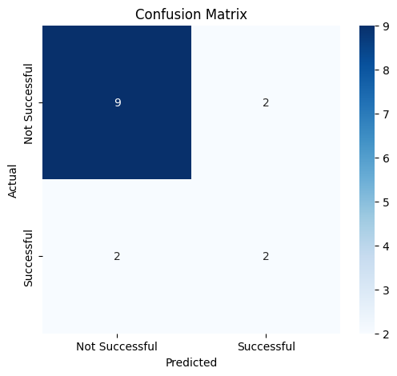
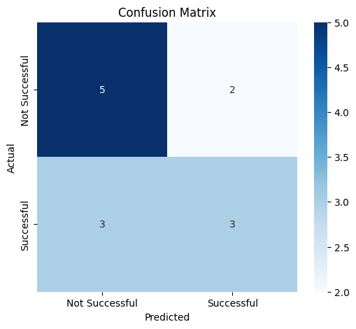
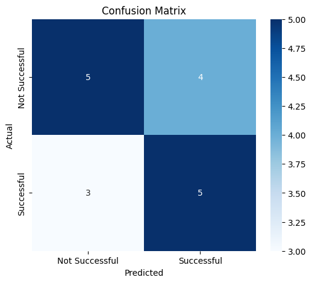

# 📊 Predicting Premier League Success: What Really Matters

## ⚽ The Big Question

When top-tier clubs scout players from lower leagues, they face a tough decision:
> **“Will this player succeed in the Premier League?”**

Our study used data analysis and machine learning to understand which
 **player attributes** best predict Premier League success—and how this
 varies by position.

---

## 🧠 What We Did

We analyzed **149 players** who transferred from lower-tier leagues into the
 Premier League:

- **Attackers** (50 players; 15 in test set) — forwards and wingers  
- **Midfielders** (43 players; 13 in test set) — central and wide midfielders  
- **Defenders** (56 players; 17 in test set) — center-backs and fullbacks  

We used 70% of our data to train the model and 30% to test it.

For each group, we built models to identify which stats from
 their **pre-Premier League** careers best predicted success.

---

## 🔍 What We Found

### 1. Success is Easier to Predict for Some Positions

**✅ Attackers:**  

- **83% accuracy** — we could predict success fairly well  
- Suggests clear patterns exist in attacker performance data

**⚠️ Midfielders & Defenders:**  

- About **62% accuracy**  
- Less predictable—possibly influenced more by team tactics or mental traits

---

### 2. Surprising Stats That Matter Most

**🔴 For Attackers:**

- ✅ *Most important:* Chances created (not goals!)  
- ✅ *Also important:* Accurate crosses  
- ❗ *Surprise:* Goal-scoring mattered less than creativity

**🟡 For Midfielders:**

- ✅ *Most important:* Ball touches  
- ✅ *Also important:* Pass success  
- 🎯 Implication: High involvement = higher success odds

**🔵 For Defenders:**

- ✅ *Most important:* Goals scored and shots taken  
- ❗ *Unexpected:* Offensive contribution mattered more than tackles or clearances

---

### 3. Modern Football Rewards Versatility

Our findings suggest that:

- **Creative attackers** outperform pure goal scorers  
- **Attack-minded defenders** thrive more than traditional stoppers  
- **Technical skills** like passing and dribbling are valuable across all roles

Modern football increasingly values **multi-role players** who contribute
 across the pitch.

---

---

## 🤖 How Well Did the Model Perform?

To evaluate performance, we used **Confusion Matrices** — visuals that show
 correct vs. incorrect predictions.

- Confusion Matrix - Attackers

*Correct predictions fall on the diagonal. Green shows successful predictions,
 while red shows incorrect classifications.*

- Confusion Matrix - Midfielders

*Model struggled slightly more with midfielders. Still, most predictions
fall along the correct diagonal.*

- Confusion Matrix - Defenders

*The model had lower confidence for defenders, indicating more unpredictable
 factors at play.*

---

## ✅ What We’re Confident About

- Attacking success is **statistically predictable**
- **Positional differences matter** — different roles need different attributes
- **Creativity and involvement** are better indicators than traditional metrics

---

## ⚠️ What We’re Less Sure About

- **Midfielder/defender patterns** — small sample sizes (13–17 players) limit reliability
- **Feature importance** — may shift in larger or newer datasets  
- **Generalization** — results might differ for other leagues or eras

---

## ❗ Where Caution is Needed

### 1. Small Sample Sizes

- Our final test groups had only 13–17 players each  
- Just a few wrong predictions can shift the accuracy dramatically

### 2. Class Imbalance

- More "unsuccessful" than "successful" players  
- Models may favor predicting failure—even when wrong

### 3. Missing Factors

We did **not** include:

- Player mentality, adaptability, or tactical intelligence  
- Team fit, coaching quality, or off-the-pitch factors  
- Metrics like expected goals (xG) or progressive passing  

### 4. Rigid Success Definition

- Success = ≥ 6.7 rating and 1000+ minutes played  
- This may oversimplify what "success" actually means

---

## ⚽ What It Means for Clubs

### 🛠️ Recruitment Strategy

- ✅ Use data modeling for **attacker scouting** — it’s effective  
- ⚠️ Combine stats with scouting for **midfielders and defenders**  
- 🧠 Prioritize **technical versatility** and modern playing styles  

### 🧪 Rethink Traditional Metrics

- Pure goals or tackles aren’t enough anymore  
- Creative and high-involvement players offer more upside

---

## 🔭 What’s Next? Future Research Directions

### To Improve Analysis

- 📈 **Larger datasets**: Aim for 500+ players per position  
- 🧬 **Advanced stats**: Include expected goals, progressive passes, etc.  
- 📅 **Time-aware models**: Track performance over longer periods  
- 🧠 **Qualitative data**: Integrate scouting reports and mental profiles  

---

## 🧵 Bottom Line

This study shows that **data-driven scouting** works best for attackers and
 offers valuable insights for all positions. But football is complex—stats
  alone can't capture it all.

> **Modern success isn’t just about position.** It’s about creativity, technical
> skill, and versatility.

Use analytics to inform recruitment—but always combine it with tactical
 understanding, scouting, and context.
